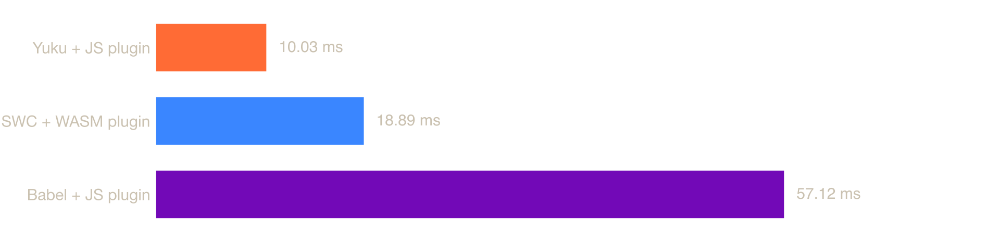
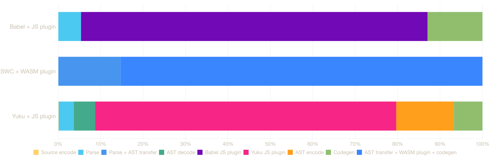

# ECMAScript Parser Benchmark (npm)

Benchmarks for ECMAScript parsers available as npm packages, including pure JavaScript parsers and native parsers (Zig, Rust) via NAPI bindings.

## System

| Property | Value |
|----------|-------|
| OS | macOS 24.6.0 (arm64) |
| CPU | Apple M3 |
| Cores | 8 |
| Memory | 16 GB |

## Parsers

### [Acorn](https://github.com/acornjs/acorn)

A tiny, fast JavaScript parser, written completely in JavaScript.

### [Babel](https://github.com/babel/babel/tree/main/packages/babel-parser)

A JavaScript compiler and parser used by the Babel toolchain.

### [Oxc](https://github.com/oxc-project/oxc)

A high-performance JavaScript and TypeScript parser written in Rust.

### [SWC](https://github.com/swc-project/swc)

An extensible Rust-based platform for compiling and bundling JavaScript and TypeScript.

### [Yuku](https://github.com/yuku-toolchain/yuku)

A high-performance & spec-compliant JavaScript/TypeScript compiler written in Zig.

## Benchmarks

### [typescript.js](https://raw.githubusercontent.com/yuku-toolchain/parser-benchmark-files/refs/heads/main/typescript.js)

**File size:** 7.83 MB


| Parser | Median | RME | Mean | Min | Max | Ops/sec | Relative |
|--------|--------|-----|------|-----|-----|---------|----------|
| **Yuku** | **46.06 ms** | **±0.55%** | **46.39 ms** | **43.71 ms** | **70.85 ms** | **21.71 ops/s** | **baseline** |
| Acorn | 138.05 ms | ±1.23% | 138.32 ms | 124.36 ms | 156.35 ms | 7.24 ops/s | 3.00× slower |
| Babel | 188.32 ms | ±3.56% | 191.29 ms | 143.77 ms | 318.37 ms | 5.31 ops/s | 4.09× slower |
| Oxc | 263.65 ms | ±0.24% | 263.50 ms | 257.55 ms | 328.30 ms | 3.79 ops/s | 5.72× slower |
| SWC | 508.10 ms | ±2.84% | 529.76 ms | 466.83 ms | 907.39 ms | 1.97 ops/s | 11.03× slower |

### [checker.ts](https://raw.githubusercontent.com/yuku-toolchain/parser-benchmark-files/refs/heads/main/checker.ts)

**File size:** 2.95 MB


| Parser | Median | RME | Mean | Min | Max | Ops/sec | Relative |
|--------|--------|-----|------|-----|-----|---------|----------|
| **Yuku** | **16.80 ms** | **±0.61%** | **17.20 ms** | **15.71 ms** | **27.98 ms** | **59.54 ops/s** | **baseline** |
| Babel | 80.02 ms | ±1.44% | 80.11 ms | 62.15 ms | 99.54 ms | 12.50 ops/s | 4.76× slower |
| Oxc | 81.69 ms | ±0.55% | 82.53 ms | 79.70 ms | 105.54 ms | 12.24 ops/s | 4.86× slower |
| SWC | 151.90 ms | ±0.38% | 152.58 ms | 149.27 ms | 199.76 ms | 6.58 ops/s | 9.04× slower |
| Acorn | Failed to parse | - | - | - | - | - | - |

### [react.js](https://raw.githubusercontent.com/yuku-toolchain/parser-benchmark-files/refs/heads/main/react.js)

**File size:** 0.07 MB


| Parser | Median | RME | Mean | Min | Max | Ops/sec | Relative |
|--------|--------|-----|------|-----|-----|---------|----------|
| **Yuku** | **0.30 ms** | **±0.30%** | **0.31 ms** | **0.28 ms** | **5.24 ms** | **3372.20 ops/s** | **baseline** |
| Acorn | 0.88 ms | ±0.22% | 0.90 ms | 0.83 ms | 4.30 ms | 1133.17 ops/s | 2.98× slower |
| Babel | 1.35 ms | ±0.69% | 1.43 ms | 0.98 ms | 8.39 ms | 739.74 ops/s | 4.56× slower |
| Oxc | 1.50 ms | ±0.23% | 1.53 ms | 1.47 ms | 7.23 ms | 665.89 ops/s | 5.06× slower |
| SWC | 2.78 ms | ±0.32% | 2.88 ms | 2.72 ms | 22.69 ms | 359.16 ops/s | 9.39× slower |

## Transform Benchmark

### Remove console

**Input:** files/react.js with the remove-console exercise appended (0.07 MB)

**Runtime:** Bun 1.3.5

**System:** darwin 24.6.0 (arm64); Apple M1 Max; 10 cores; 32 GB

**Versions:** Babel 8.0.1; Yuku parser/codegen/AST 0.8.5/0.8.5/0.8.5

| Transformer | Median | RME | Mean | Min | Max | Ops/sec | Removed | Output | Relative |
|-------------|--------|-----|------|-----|-----|---------|---------|--------|----------|
| **Yuku** | **1.60 ms** | **±1.01%** | **1.75 ms** | **1.46 ms** | **7.44 ms** | **623.77 ops/s** | **2** | **0.05 MB** | **baseline** |
| Babel | 7.43 ms | ±1.61% | 7.90 ms | 5.45 ms | 50.81 ms | 134.58 ops/s | 2 | 0.05 MB | 4.63× slower |

Each of the 3 independent runs warms up for 1000 ms and samples for 5000 ms. Both implementations remove the same calls and generate JavaScript on every iteration.

### Styled components

**Input:** 240 styled components and 483 tagged templates (0.12 MB)

**Runtime:** Bun 1.3.5

**System:** darwin 24.6.0 (arm64); Apple M1 Max; 10 cores; 32 GB

**Versions:** Babel/core 8.0.1/2.3.0; SWC/core 1.15.46/12.19.0; Yuku parser/codegen/AST 0.8.5/0.8.5/0.8.5

**Exact replay:** `bun run reproduce:styled-components` writes `result/styled-components.json`

The Yuku JS plugin is a fixture-scoped implementation of the core operations exercised here, not a complete port of babel-plugin-styled-components. It covers import detection, styled factories, attrs chains, helper templates, CSS minification, display names, component IDs, PURE annotations, and template lowering. It does not claim parity for features such as the css prop, CommonJS detection, namespaces, top-level import path configuration, or Babel's exact filename and hashing behavior. These results compare the three pipelines on the validated fixture contract, not full plugin feature parity.



| Transformer | Median | RME | Mean | Min | Max | Ops/sec | Components | PURE | Output | Relative |
|-------------|--------|-----|------|-----|-----|---------|------------|------|--------|----------|
| **Yuku + JS plugin** | **10.03 ms** | **±1.50%** | **10.48 ms** | **9.16 ms** | **33.20 ms** | **99.73 ops/s** | **240** | **483** | **0.14 MB** | **baseline** |
| SWC + WASM plugin | 18.89 ms | ±1.20% | 19.14 ms | 17.85 ms | 40.25 ms | 52.92 ops/s | 240 | 483 | 0.15 MB | 1.88× slower |
| Babel + JS plugin | 57.12 ms | ±3.01% | 58.41 ms | 47.64 ms | 106.05 ms | 17.51 ops/s | 240 | 243 | 0.14 MB | 5.70× slower |

Independent run medians (ms):

- Yuku + JS plugin: 10.027, 10.141, 10.027
- SWC + WASM plugin: 18.782, 18.909, 18.895
- Babel + JS plugin: 57.115, 57.909, 56.127

Each of the 3 independent runs warms up for 1000 ms and samples for 5000 ms. Every output is reparsed and checked for display names, unique component IDs, CSS minification, PURE annotations, and complete tagged-template lowering.

#### Stage breakdown

This diagnostic profile splits each implementation at its real callable boundaries. Stage means are reported because means are additive; the stages for one transformer sum to its profiled pipeline mean.



| Transformer | Stage | Runtime | Mean | Share | Independent run means |
|-------------|-------|---------|------|-------|-----------------------|
| Babel + JS plugin | parse | JS | 3.40 ms | 5.4% | 3.464, 3.412, 3.337 ms |
| Babel + JS plugin | plugin transform | JS | 51.79 ms | 81.7% | 52.195, 51.157, 52.013 ms |
| Babel + JS plugin | codegen | JS | 8.22 ms | 13.0% | 8.133, 8.335, 8.188 ms |
| SWC + WASM plugin | parse + AST transfer | native + JS | 6.64 ms | 14.7% | 6.870, 6.432, 6.612 ms |
| SWC + WASM plugin | AST transfer + plugin + codegen | JS + WASM + native | 38.50 ms | 85.3% | 39.142, 37.888, 38.483 ms |
| Yuku + JS plugin | source encode | JS | 0.01 ms | 0.1% | 0.009, 0.010, 0.010 ms |
| Yuku + JS plugin | parse | native | 0.38 ms | 3.6% | 0.383, 0.374, 0.394 ms |
| Yuku + JS plugin | AST decode | JS | 0.53 ms | 5.0% | 0.530, 0.519, 0.553 ms |
| Yuku + JS plugin | plugin transform | JS | 7.56 ms | 71.0% | 7.569, 7.403, 7.717 ms |
| Yuku + JS plugin | AST encode | JS | 1.45 ms | 13.6% | 1.432, 1.441, 1.463 ms |
| Yuku + JS plugin | codegen | native | 0.72 ms | 6.8% | 0.712, 0.700, 0.753 ms |

The stage profile also uses 3 independent runs, each with 1000 ms warmup and 5000 ms measurement. Yuku is measured as source UTF-8 encoding, native parse, generated JS AST decode, JS plugin transform, generated JS AST encode, and native codegen. Babel is split through its public parse and transform-from-AST APIs. SWC's WASM plugin API returns generated code rather than the transformed AST, so its AST transfer, WASM plugin, and native codegen remain one directly measured stage.

The end-to-end table above remains the cross-tool comparison. Split profiles make additional API calls and are intended to explain where each pipeline spends time, not to replace the end-to-end latency.

## Run Benchmarks

### Prerequisites

- [Bun](https://bun.sh/) 1.3.5 - package manager and canonical benchmark runtime
- [Node.js](https://nodejs.org/) 26.7.0 - optional alternate benchmark runtime

### Exact styled-components reproduction

The checked-in styled-components tables were produced from the immutable
`styled-components-benchmark-v1` tag. The reproduction script rejects a mismatched runtime,
overrides all benchmark settings with the recorded values, validates the result metadata, and
writes the raw measurements to `result/styled-components.json`:

```bash
git clone https://github.com/SoonIter/ecmascript-parser-benchmark-js.git
cd ecmascript-parser-benchmark-js
git checkout styled-components-benchmark-v1
bun --version # must print 1.3.5
bun install --frozen-lockfile
bun run reproduce:styled-components
```

Absolute latency depends on the CPU, OS load, power mode, and thermal state. Reproduction here
means identical source revision, dependency graph, runtime version, fixture, options, warmup,
duration, process isolation, run count, validation, and aggregation. Compare the new raw result
with the checked-in measurement using:

```bash
git diff -- result/styled-components.json
```

The harness also runs under Node. This is a separate runtime measurement and therefore writes a
separate result file instead of overwriting the canonical Bun result:

```bash
node --version # must print v26.7.0
node --import tsx scripts/reproduce-styled-components.ts
# writes result/styled-components-node.json
```

The full Node verification run is checked in at
[`result/styled-components-node.json`](result/styled-components-node.json). It is not mixed
into the Bun tables or charts because JavaScript runtime performance is part of the measured
pipeline.

### Steps

1. Clone the repository:

```bash
git clone https://github.com/yuku-toolchain/ecmascript-parser-benchmark-js.git
cd ecmascript-parser-benchmark-js
```

2. Install dependencies:

```bash
bun install
```

3. Run benchmarks:

```bash
bun bench
```

To run only the end-to-end remove-console transform benchmark:

```bash
bun run bench:transform
```

To run the styled-components plugin comparison:

```bash
bun run bench:styled-components
```

This will run benchmarks on all test files. Results are saved to the `result/` directory.

Benchmark duration is configurable via the environment variables `BENCH_TIME` (timed duration per run in ms, default 10000), `BENCH_WARMUP` (warmup duration in ms, default 2000), and `BENCH_RUNS` (independent runs per parser, default 3). The stage profile inherits those durations; `PROFILE_TIME` and `PROFILE_WARMUP` override them. `STYLED_COMPONENTS_COUNT` changes the styled-components fixture size (default 240). For the most stable numbers, run on AC power with no other applications running.

## Methodology

Each parser is benchmarked using [Tinybench](https://github.com/tinylibs/tinybench) with warmup iterations followed by multiple timed runs. Each run measures the time to parse the source text into an AST. Source files are read from disk once and kept in memory for all iterations.

To keep results stable and fair, every parser × file combination runs in its own freshly spawned process, so JIT state and GC pressure from one parser never affect another. Each combination is benchmarked in multiple independent runs (3 by default), and the reported median is the median across those runs, a statistic that is robust to GC pauses, OS scheduling blips, and other outliers. The RME column shows the relative margin of error (99% confidence) within a run. Differences between parsers smaller than their combined margins should be treated as noise.

Native parsers (Oxc, SWC, Yuku) run through their respective NAPI bindings, so measured time includes the binding overhead. Pure JS parsers (Acorn, Babel) run directly in the JavaScript runtime.

The remove-console transform benchmark measures the complete public API pipeline on every iteration. Babel runs parse, plugin traversal, and code generation through `@babel/core.transformSync`. Yuku runs native Zig parse, generated binary decoding into a JavaScript ESTree, the JavaScript visitor, generated binary encoding, and native Zig code generation. The input is held in memory, generated output is consumed, comments and source maps are disabled on both sides, and each transformer runs in a fresh process. The appended exercise contains both a removable statement call and a console call nested in an expression, so the plugin must perform both removal and replacement.

The styled-components benchmark uses the same end-to-end boundary. Babel runs `babel-plugin-styled-components` in JavaScript, SWC runs `@swc/plugin-styled-components` as a WASM plugin, and Yuku runs the fixture-scoped JavaScript plugin in `scripts/yuku-styled-components-plugin.ts` between its generated binary decoder and encoder. All three enable `displayName`, `ssr`, `minify`, and `pure`; parse and generate code on every timed iteration; and transform the same mix of `styled.tag`, `styled(Component)`, `.attrs()`, nested `css`, `keyframes`, `createGlobalStyle`, and interpolations. A correctness pass runs before timing, which also moves one-time module loading and SWC WASM compilation outside the measured steady-state transforms. Babel's official plugin does not annotate nested function-body `css` helpers as PURE while SWC does, so the result records the actual annotation count instead of claiming byte-for-byte output parity.

**Why is Oxc slower than Babel here?** By default, `oxc-parser` serializes the AST to a JSON string on the Rust side and runs `JSON.parse` on the JavaScript side when you access `result.program`. Oxc's Rust-side parsing is extremely fast. It is this serialization boundary that dominates the end-to-end time. (If you call `parseSync` and never touch the result, Oxc looks much faster, because `program` is a lazy getter that defers the `JSON.parse`. The benchmarks above measure the time to actually obtain the full AST, which is what any real consumer of a parser does.)

**What about Oxc's `experimentalRawTransfer`?** Oxc also has a hidden experimental path that removes the JSON step entirely. It is not part of Oxc's documented parser options, but when the flag is passed, Rust parses directly into a huge `ArrayBuffer` shared with JavaScript, and generated JS code deserializes AST nodes straight out of that memory. It is genuinely clever engineering, and with it enabled Oxc's end-to-end numbers land much closer to Yuku's, since the two pipelines become architecturally the same (binary buffer in, ESTree objects out).

It is not part of the results above for a simple reason. This benchmark measures each parser's default, documented, stable API, the code path every user gets from `npm install`. Raw transfer today is an undocumented flag that is none of those things, and it cannot run here at all.

- **It does not work on Bun**, which this benchmark runs on. `oxc-parser`'s own `rawTransferSupported()` check returns `false` on Bun, and on Node < 22 and Deno < 2, because the design requires allocating an `ArrayBuffer` larger than 4 GiB. Enabling the option in this harness would simply throw.
- **It needs gigabytes of reserved memory per parse.** The trick that makes it fast is that the Rust arena is a fixed 2 GiB block aligned to a 4 GiB boundary, so 64-bit Rust pointers can be read from JavaScript as 32-bit buffer offsets. Achieving that alignment means reserving ~6 GiB of address space per buffer. Most of it stays virtual until touched, but every concurrent parse still needs its own dedicated 2 GiB arena, source and AST together must fit inside that block, and only 64-bit little-endian platforms are supported.

If Oxc stabilizes raw transfer as its default path, we will happily benchmark it. That is the fair comparison we want.

**Why is Yuku fast without any of that?** Yuku reaches the same zero-serialization end state, but by construction rather than by workaround. Its Zig parser does not build a pointer graph that later needs remapping. The AST *is already binary*, a flat table of fixed-size 44-byte node records addressed by index, with strings stored as offsets into the source. That layout is its own transfer format. It crosses the NAPI boundary as one small buffer sized to the actual AST, and a generated decoder reads it in JavaScript through typed arrays, conceptually the same read side as Oxc's raw transfer minus the pointer-to-offset machinery that forces the giant fixed arena.

Because there are no pointers to remap, there is no 2 GiB block, no 4 GiB alignment requirement, no multi-gigabyte reservation, and no runtime gate. The same code path runs on Node, Bun, and Deno, parses files in parallel without multiplying memory, and uses only the memory the file actually needs. Zig's comptime generates both the binary layout and the JavaScript decoder from one source of truth, so they can never drift apart. The numbers in the tables above are Yuku's default and only mode. There is no faster experimental path being held back and nothing extra to enable.
